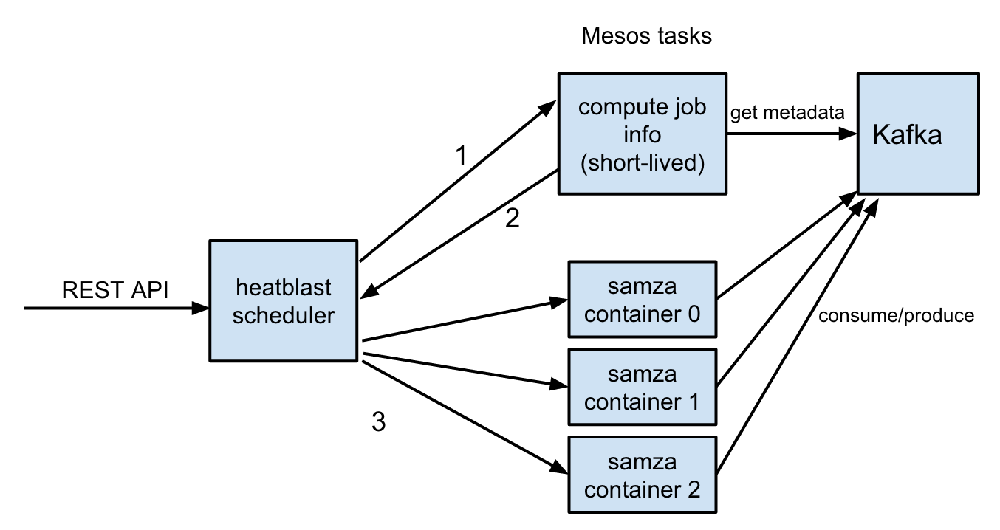
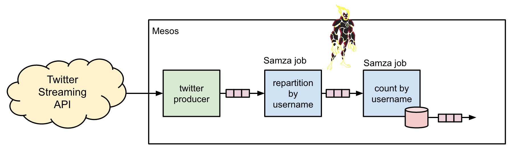

# heatblast


[http://ben10.wikia.com/wiki/Heatblast](http://ben10.wikia.com/wiki/Heatblast)

A [Mesos](http://mesos.apache.org) framework for scheduling [Samza](http://samza.apache.org) jobs. Built during the [Mesoscon 2015 Hackathon](http://mesoscon2015.sched.org/event/c210df078c68e5d78151ed7e664b3c4a?iframe=no&w=i:0;&sidebar=yes&bg=no#.VdTFK5NVhBc).

The existing Samza Mesos framework https://github.com/Banno/samza-mesos runs one Mesos framework for each Samza job. When you have a large number of Samza jobs, this creates a large number of Mesos frameworks. We've run into problems in this case where Mesos will stop sending offers to Marathon after Marathon runs all of these Samza frameworks.

This Samza Mesos framework runs a single Mesos framework for all Samza jobs, somewhat like a Marathon for Samza. It provides a REST/JSON API to submit jobs, query job status, etc and monitors execution of Samza jobs. Each Samza job runs as a set of Mesos tasks, one task per Samza container.

Managed via [waffle.io](https://waffle.io): [](http://waffle.io/Banno/heatblast)

## Status

This is a proof-of-concept built during the Mesoscon 2015 Hackathon to see if we could have a generic Mesos framework schedule any Samza job. It worked, and we won the hackathon! [Watch the 
live demo video](https://www.youtube.com/watch?v=KES1Ud4MtDE).

That said, this is definitely not production-ready code (yet). Since we run Samza jobs on Mesos in production, we will continue to improve this scheduler over time.

## Overview



Before a Samza job can be run on Mesos, information about how that job runs needs to be computed up front. This requires the full config, code, and dependent libraries for that job, which a generic 
scheduler does not have access to. So the approach in Heatblast is to first run a short-lived Mesos task that does have access to these things to compute this job info and pass it back to the 
scheduler. Then, the scheduler can run the Samza job as a set of Mesos tasks, one per [Samza container](http://samza.apache.org/learn/documentation/0.9/container/samza-container.html).

## Example



The example is a streaming map-reduce system that processes the Twitter Streaming API to compute the count of tweets per username. This is performed by two separate Samza jobs, with each job 
running across three Samza containers (i.e. Mesos tasks).

## Building

```
sbt clean compile docker
```

## Running

```
big up -d marathon kafka

cd heatblast-scheduler/marathon
./run.sh

#Wait for Heatblast scheduler to run

curl -X POST -H "Content-Type: application/json" -d '{"jobName": "ExampleSamzaTask", "dockerImage": "registry.banno-internal.com/heatblast-example-samza:latest"}' http://dev.banno.com:8181/jobs

curl -X POST -H "Content-Type: application/json" -d '{"jobName": "RepartitionTweetsByUsernameTask", "dockerImage": "registry.banno-internal.com/heatblast-example-samza:latest"}' http://dev.banno.com:8181/jobs

curl -X POST -H "Content-Type: application/json" -d '{"jobName": "CountTweetsByUsernameTask", "dockerImage": "registry.banno-internal.com/heatblast-example-samza:latest"}' http://dev.banno.com:8181/jobs
```
